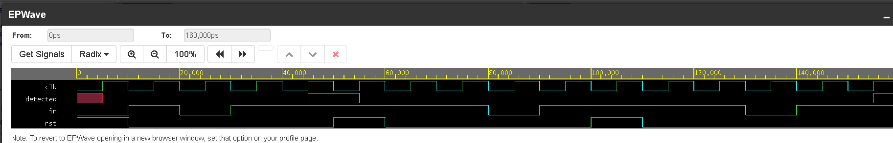

# Moore FSM — 1011 Sequence Detector in Verilog

> Moore FSM-based 1011 sequence detector implemented in Verilog HDL  
> RTL Design + Functional Verification using EDA Playground

> Madras Institute of Technology, Anna University · 2026

---

## Overview

A Moore Finite State Machine (FSM) implemented in Verilog HDL to detect  
the binary sequence `1011` in a serial input bit stream.

This project strengthens RTL design fundamentals including FSM state  
encoding, next-state logic, and output logic using separate sequential  
and combinational `always` blocks.

A functional testbench verifies sequence detection across multiple input  
patterns, including overlapping sequences.

---

## FSM State Transition Table

| State | Meaning           | Input=0 | Input=1 |
|-------|-------------------|---------|---------|
| S0    | Idle / Reset      | S0      | S1      |
| S1    | Got 1             | S2      | S1      |
| S2    | Got 10            | S0      | S3      |
| S3    | Got 101           | S2      | S4      |
| S4    | Got 1011 DETECTED | S2      | S1      |

Output `detected = 1` only in **S4**  
(Moore machine: output depends only on current state).

---

## Module Ports

| Port     | Direction | Width | Description                   |
|----------|-----------|-------|-------------------------------|
| clk      | Input     | 1-bit | Clock signal                  |
| rst      | Input     | 1-bit | Synchronous active-high reset |
| in       | Input     | 1-bit | Serial input bit stream       |
| detected | Output    | 1-bit | HIGH when `1011` is detected  |

---

## Testbench Verification

| Test | Input Stream | Expected Output |
|------|--------------|-----------------|
| 1    | 1011         | detected = 1 ✅ |
| 2    | 1101         | detected = 0 ✅ |
| 3    | 11011        | detected = 1 ✅ (overlapping) |

---

## Simulation Waveform

Waveform verifies correct operation of:

- `clk`
- `rst`
- `in`
- `detected`

`detected` goes HIGH after receiving sequence `1011`, confirming correct  
Moore FSM behaviour.

---

## Key Learnings

- Designing Moore FSMs with state encoding in Verilog
- Separating sequential and combinational logic into distinct `always` blocks
- Writing testbenches for clocked sequential circuits
- Verifying FSM state transitions through waveform analysis in EPWave

---

## Repository Files

| File         | Description                       |
|--------------|-----------------------------------|
| design.sv    | Moore FSM RTL — 1011 detector     |
| testbench.sv | Functional verification testbench |
| waveform.png | Simulation waveform output        |
| README.md    | Project documentation             |

---

## How to Run

1. Open https://edaplayground.com  
2. Paste `design.sv` into the **Design** panel  
3. Paste `testbench.sv` into the **Testbench** panel  
4. Select **Icarus Verilog** as simulator  
5. Enable **Open EPWave after run**  
6. Click **Run** to simulate and view waveform  

---

## Future Improvements

- Extend detector for configurable bit sequences
- Implement Mealy FSM version for comparison
- Parameterize state encoding styles
- Synthesize and verify on FPGA platforms

---

## Author

**Manikandan Prabhu B**  
B.E. Electronics and Communication Engineering  
Madras Institute of Technology, Anna University
